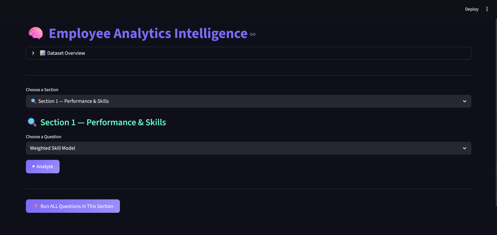
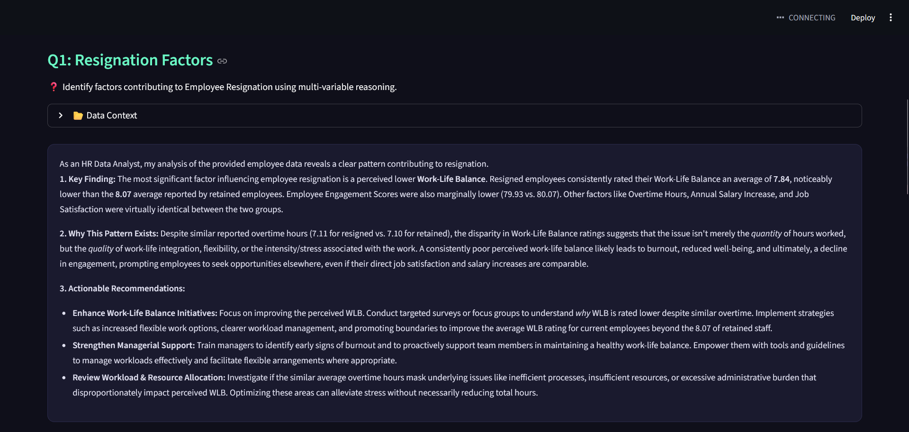

# Employee Analytics using GenAI

This project is part of the Quantiphi GenAI Data Analytics use case assignment.
I have built an AI-powered HR analytics tool that uses Google Gemini API to analyze employee data and generate business insights.

---

## What This Project Does

We have a dataset of 4000 employees with 109 columns including performance ratings, skills, salary, project outcomes, training records and more.

Instead of manually analyzing this data, I used Generative AI (Gemini) to:
- Read real statistics from the CSV
- Send them to the AI with specific HR questions
- Get back detailed business insights and recommendations

This follows the RAG (Retrieval Augmented Generation) approach where real data is retrieved and passed to the AI so it cannot hallucinate.

---

## Project Structure

```
employee_analytics/
├── config.py                  # API key and settings
├── data_loader.py             # reads and filters the CSV
├── ai_engine.py               # calls Gemini API
├── ui.py                      # Streamlit web UI
├── requirements.txt           # libraries needed
├── data/
│   └── employee_data.csv      # employee dataset
└── sections/
    ├── section1_performance.py
    ├── section2_training.py
    ├── section3_behavior.py
    ├── section4_projects.py
    ├── section5_attrition.py
    ├── section6_compensation.py
    └── section7_recruitment.py
```

Each section is a separate file that handles one topic. This keeps the code clean and easy to understand.

---

## Sections Covered

| Section | Topic |
|---------|-------|
| 1 | Employee Performance and Skill Analytics |
| 2 | Training, Mentorship and Development |
| 3 | Behavioral and Soft Skills Intelligence |
| 4 | Project and Work Performance Analysis |
| 5 | Attrition and Retention Intelligence |
| 6 | Compensation and Benefits Analysis |
| 7 | Recruitment and Hiring Effectiveness |

---

## How to Run

### Step 1 - Clone the repository
```
git clone https://github.com/YOUR_USERNAME/employee-analytics-genai
cd employee-analytics-genai
```

### Step 2 - Install required libraries
```
pip install -r requirements.txt
```

### Step 3 - Add your Gemini API key
Open `config.py` and replace:
```python
GEMINI_API_KEY = "YOUR_GEMINI_KEY_HERE"
```
Get your free API key from: https://aistudio.google.com/apikey

### Step 4 - Run the app
```
streamlit run ui.py
```
The app will open in your browser at http://localhost:8501

---

## How It Works (RAG Approach)

```
User selects a Section and Question
        ↓
section file pulls real stats from CSV using pandas
        ↓
Those stats + question are sent to Gemini API
        ↓
Gemini reasons over the real data
        ↓
Business insight is shown in the UI
```

This ensures all answers are grounded in actual data — not AI guesswork.

---

## Tech Stack

- Python
- Streamlit (UI)
- Pandas (data processing)
- Google Gemini API (free)
- Google AI Studio

---

## Dataset

- 4001 employee records
- 109 columns
- Covers performance, skills, salary, projects, training, attrition and recruitment data

---

## Screenshots

### Main Dashboard


### AI Analysis Output
